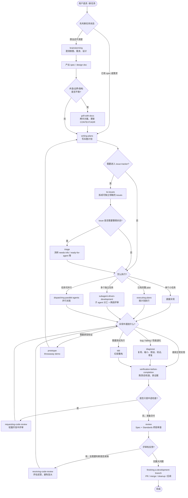

# harness — bundle generator

This directory contains the generator that assembles a curated set of skills
from the `third-party/` submodules into this repo's dogfooded Claude Code and
Codex bundles.

## Purpose

`.claude/`, `.agents/skills/`, and `.codex/hooks*` are not hand-maintained.
They are generated output: portable, self-contained bundles pulled from the
various third-party skill collections vendored under `third-party/`.
Regenerating them lets us pick up upstream changes to those submodules while
keeping full control over exactly which skills ship and how they behave in this
repo.

The Claude bundle includes skills, hooks, commands, and `settings.json`. The
Codex bundle emits repo-discoverable skills under `.agents/skills` and Codex
lifecycle hooks under `.codex/hooks.json` + `.codex/hooks/`. Claude Code
markdown commands are not emitted for Codex because Codex does not use
`.claude/commands/*.md` as repo-local slash commands.

## Selection rationale

Why each skill was included, dropped, or modified is documented in
`docs/harness/skills-reconciliation.md`. Consult that doc before changing the
manifest — it explains the reasoning, not just the result.

## Manifest

`harness/manifest.json` is the source of truth for what gets generated. Each
entry specifies:

- `source` — which third-party submodule the skill comes from
- `path` — the path to the skill within that submodule
- `manualOnly` — whether the skill should be flagged
  `disable-model-invocation: true` in its frontmatter (i.e. invokable only
  when a user explicitly asks for it, not auto-triggered by the model)

The `manualOnly` frontmatter injection preserves the source file's existing
line-ending style (CRLF vs LF) — important because several vendored skills are
checked out CRLF on Windows (`core.autocrlf=true`). Don't "simplify"
`harness/lib/frontmatter.js` to hard-code `\n`; that reintroduces mixed line
endings (see its CRLF tests).

## Local patches (overlays)

`harness/overlays/<skill>/` holds local modifications layered on top of a
skill's files after they're copied from the source submodule. Use overlays to
carry repo-specific edits (e.g. content folds, fixes) that would otherwise be
silently lost the next time the generator runs and re-copies from upstream.

## Usage

```
cd harness && node generate.js
```

Rebuilds `../.claude/`, `../.agents/skills`, and `../.codex/hooks*` from
scratch (removing generated entries no longer in the manifest, copying current
ones, and applying overlays and `manualOnly` frontmatter flags).

```
cd harness && node --test
```

Runs the generator's test suite.

```
cd harness && node sync.js --suite codex --targets ../some-project
cd harness && node sync.js --suite both --targets ../some-project
```

Syncs the generated bundle into target projects. The default suite is
`claude`; use `codex` for `.agents/` + `.codex/`, or `both` when a project
should carry both agent bundles.

## Important: do not hand-edit generated bundles

`.claude/`, `.agents/skills/`, and `.codex/hooks*` are committed, portable
artifacts — copy the matching generated directories into any project to use
this bundle there.

Because it is regenerated from scratch on every run, any changes made
directly inside those generated directories will be silently overwritten the
next time `node generate.js` runs. If you need a local modification to a skill,
put it in `harness/overlays/<skill>/` instead, so it survives regeneration.

## Skills workflow


